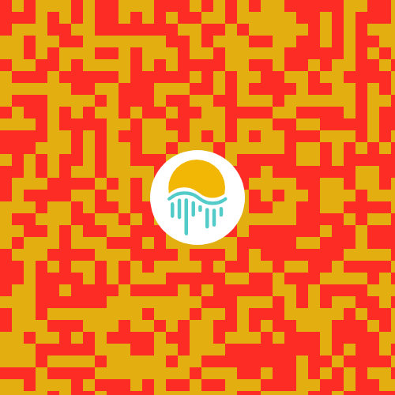
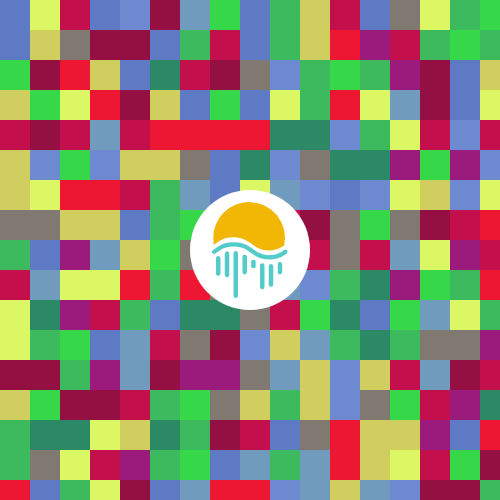
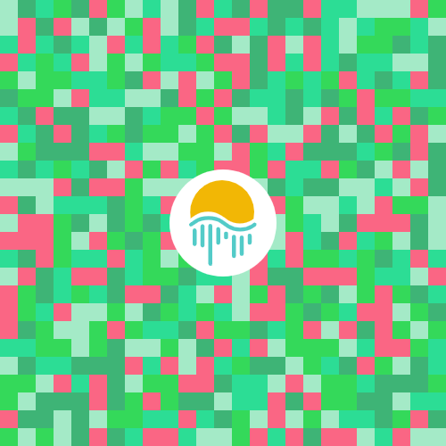
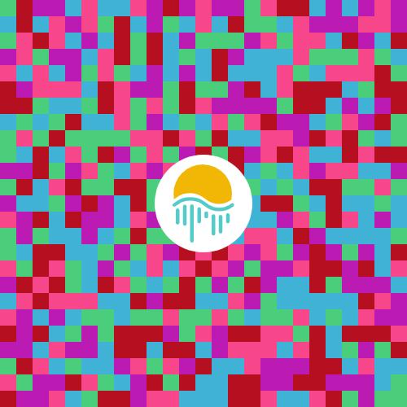

# NFTs Showcase & Mint Dapp

NFT DApp on Moonriver where users can view their NFT collections (also in a 3D gallery), Mint new NFTs and share link of their collection to others

### Demonstration:

1. Website live: https://showcase-nfts.netlify.app
2. Video demo: 

### Description of project sections:

- <ins>**Home page:**</ins> Contains brief information about the project;
- <ins>**NFT Collection Showcase page:**</ins> On this page, owners of NFTs from Moonriver can view their collections. Also they can create and share a user-friendly link for their collections;
- <ins>**Mint NFT page:**</ins> Here, users can mint a new MoonriverPixel NFT and transfer them to other wallet. The NFT itself is a square picture filled with pixels (a few examples of such NFTs can be seen below). The color and size of the pixels can be selected, and when the corresponding button is pressed, a new image is generated with random colors for the pixels. After connecting the wallet, users can mint NFTs;
- <ins>**3D gallery:**</ins> This is a 3D gallery in the browser, where users can also look at their collections, but in 3D form. Users can walk through this gallery and admire the NFTs on the gallery walls using the keyboard (WASD) and mouse.

### Examples of generated MoonriverPixels:

1           |  2 |  3 |  4
:-------------------------:|:-------------------------:|:-------------------------:|:-------------------------:
  |   |   |  

### What was used?

1. HTML & CSS & JS
2. [**NodeJS**](https://nodejs.org/en/)
3. [**MongoDB**](https://www.mongodb.com/) - database
4. [**Express**](https://expressjs.com/) - Fast, unopinionated, minimalist web framework for Node.js
5. [**web3js**](https://web3js.readthedocs.io/en/v1.7.3)
6. [**Three.js**](https://threejs.org) - Library for creating the 3D gallery;
8. [Hardhat](https://hardhat.org/) - ethereum development environment
9. [Infura IPFS](https://infura.io/product/ipfs)

### How it was built:

The front-End of this DApp was created using HTML, CSS, JS. 
The MongoDB database was used to store links for collections created by users. The implementation of write and read operations from the database was done through the REST API server created with nodeJs + express.

Some config data from `frontend/scripts/config.js` file:
  * `nftCollectionAbi` - Part of ERC721 contract ABI with following methods: `balanceOf`, `tokenOfOwnerByInde`, `tokenURI`
  * `moonriverPixelAddress` - Contract address of MoonriverPixels NFTs (deployed by me)
  * `moonriverPixelContractAbi` - the ABI of MoonriverPixels NFT contract
  * `CHAIN_ID` - required chain id (1285 - Moonriver Mainnet)
  * `serverUrl` - URL of created API server
  * `RPC` - Moonriver Mainnet RPC (was used a public rpc)

### Future plans / To do:

* Add new NFT collections from Moonriver;
* Improve the method of retrieving NFTs data: indexing data to off-chain. This will avoid API rate limiting when interacting directly with the smart contracts and it will also speed up the time of receiving data from the IPFS (sometimes the delay is very large);
* Improve the design of 3D gallery, add new buildings, the ability to interact with some objects directly from the gallery, multiplayer feature;
* and other...

